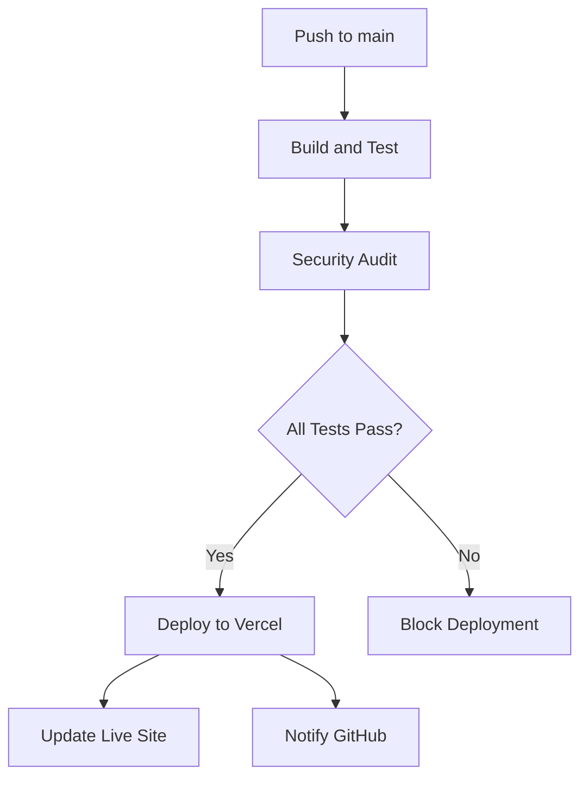
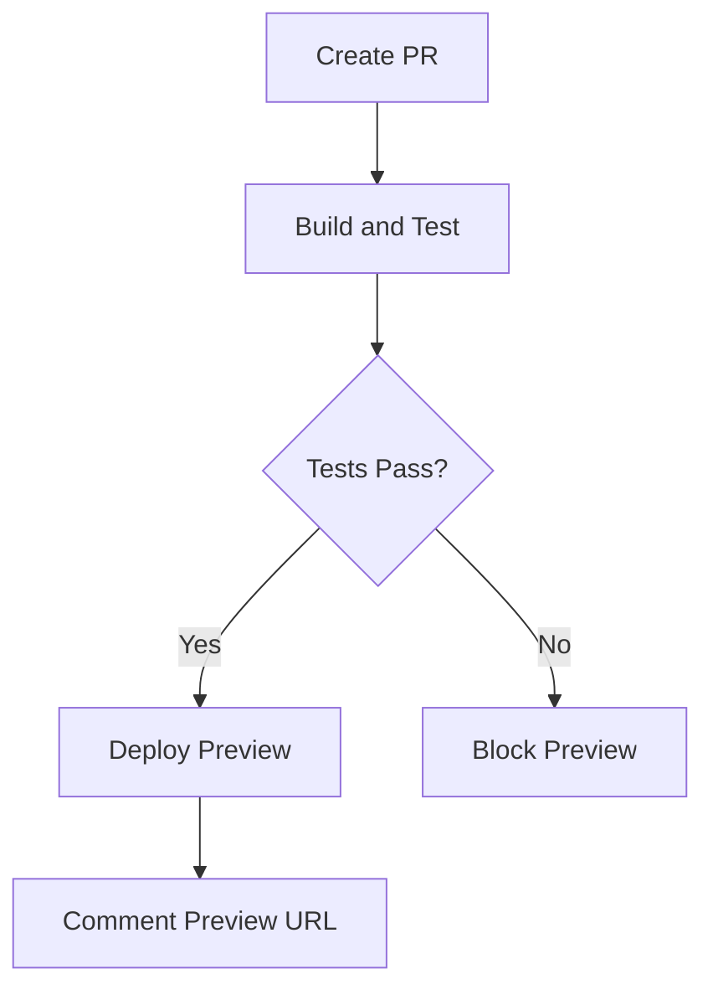

# 🚀 Continuous Deployment Guide - Vercel Integration

## 📋 **Overview**

This document provides a complete guide for setting up **Continuous Deployment (CD)** with **GitHub Actions** and **Vercel** for the Advanced React TypeScript Ecommerce Store.

---

## 🎯 **CD Pipeline Features**

### ✅ **What's Implemented**

#### **🔄 Automatic Deployment**
- **Production Deployment**: Every push to `main` branch automatically deploys to live site
- **Preview Deployments**: Every pull request gets its own preview URL
- **Zero-Downtime**: Seamless updates without service interruption

#### **🛡️ Quality Gates**
- **Tests Must Pass**: Deployment blocked if any tests fail
- **Build Verification**: Production build must succeed before deployment
- **Security Audit**: Vulnerability scan before deployment
- **Multi-Node Testing**: Compatibility verified across Node.js versions

#### **🌍 Global Infrastructure**
- **Vercel CDN**: Global edge network for fast loading
- **Custom Domains**: Production domain support
- **HTTPS**: Automatic SSL certificates
- **Environment Variables**: Secure configuration management

---

## ⚙️ **Setup Instructions**

### **Step 1: Vercel Account Setup**

#### **1.1 Create Vercel Account**
```bash
# Install Vercel CLI globally
npm install -g vercel

# Login to your account
vercel login
```

#### **1.2 Connect GitHub Repository**
1. Go to [Vercel Dashboard](https://vercel.com/dashboard)
2. Click "Import Project"
3. Select your GitHub repository
4. Click "Import"

### **Step 2: Get Vercel Configuration**

#### **2.1 Link Local Project**
```bash
# In your project directory
vercel link

# Follow prompts to:
# - Select scope (your username/team)
# - Link to existing project or create new one
# - Confirm project settings
```

#### **2.2 Get Project Information**
```bash
# View project configuration
cat .vercel/project.json

# Should show:
{
  "orgId": "your-org-id",
  "projectId": "your-project-id"
}
```

#### **2.3 Get Vercel Token**
1. Go to [Vercel Dashboard Settings](https://vercel.com/account/tokens)
2. Create new token named "GitHub Actions"
3. Copy the token (save securely - shown only once)

### **Step 3: Configure GitHub Secrets**

#### **3.1 Add Repository Secrets**
Go to your GitHub repository → Settings → Secrets and variables → Actions

Add these secrets:

```bash
# Required for deployment
VERCEL_TOKEN=your_vercel_token_here

# Optional - for advanced configuration
VERCEL_ORG_ID=your_org_id_here
VERCEL_PROJECT_ID=your_project_id_here
```

#### **3.2 Secret Configuration**
- **Name**: `VERCEL_TOKEN`
- **Value**: The token from Vercel dashboard
- **Description**: "Vercel deployment token for GitHub Actions"

### **Step 4: Verify Configuration**

#### **4.1 Check Workflow File**
Verify `.github/workflows/main.yml` includes deployment jobs:

```yaml
deploy:
  name: Deploy to Vercel
  runs-on: ubuntu-latest
  needs: [build-and-test, security-audit]
  if: github.ref == 'refs/heads/main' && github.event_name == 'push'
  # ... deployment steps
```

#### **4.2 Test Deployment**
1. **Create a test commit** to main branch:
```bash
git add .
git commit -m "Test: Trigger deployment"
git push origin main
```

2. **Monitor GitHub Actions**:
   - Go to repository → Actions tab
   - Watch workflow execution
   - Verify all jobs pass including deployment

3. **Check Vercel Dashboard**:
   - Verify deployment appears in project deployments
   - Check deployment logs for any issues
   - Confirm site is live

---

## 🔄 **Workflow Explanation**

### **CI/CD Pipeline Flow**

#### **For Main Branch Pushes:**


#### **For Pull Requests:**


### **Job Dependencies**
- **`build-and-test`**: Runs first with matrix strategy (Node 18.x & 20.x)
- **`security-audit`**: Runs after build-and-test succeeds
- **`deploy`**: Runs only after both previous jobs succeed
- **`staging-deploy`**: Runs for PRs after build-and-test succeeds

---

## 🌍 **Deployment Environments**

### **Production Environment**
- **Trigger**: Push to `main` branch
- **URL**: Custom domain or `*.vercel.app`
- **Configuration**: Production environment variables
- **Features**: 
  - Global CDN
  - Automatic HTTPS
  - Custom domains
  - Analytics

### **Preview Environment**
- **Trigger**: Pull request creation/update
- **URL**: Unique preview URL per PR
- **Configuration**: Preview environment variables
- **Features**:
  - Temporary environment
  - Automatic PR comments
  - Branch-specific builds

---

## 🔧 **Troubleshooting**

### **Common Issues**

#### **Deployment Fails**
```bash
# Check these common issues:
1. Verify VERCEL_TOKEN is correctly set
2. Check build logs in GitHub Actions
3. Ensure Vercel project exists and is linked
4. Verify vercel.json configuration
```

#### **Build Errors**
```bash
# Debug build issues:
1. Run build locally: npm run build
2. Check Node.js version compatibility
3. Verify all dependencies are in package.json
4. Check for environment-specific code
```

#### **Secrets Not Working**
```bash
# Verify secrets configuration:
1. Go to GitHub repo → Settings → Secrets
2. Check secret names match workflow exactly
3. Recreate secrets if needed
4. Verify repository permissions
```

### **Debug Commands**
```bash
# Test Vercel CLI locally
vercel --debug

# Check project status
vercel inspect

# View deployment logs
vercel logs [deployment-url]

# Test build locally
npm run build && npx serve dist
```

---

## 📊 **Monitoring & Maintenance**

### **Monitoring Deployments**
1. **GitHub Actions**: Monitor workflow runs in Actions tab
2. **Vercel Dashboard**: Track deployments and performance
3. **Logs**: Review build and runtime logs for issues
4. **Analytics**: Monitor site performance and usage

### **Best Practices**
- **Regular Updates**: Keep dependencies updated
- **Monitor Performance**: Track Core Web Vitals
- **Security**: Regularly audit dependencies
- **Testing**: Maintain good test coverage
- **Documentation**: Keep deployment docs updated

### **Rollback Strategy**
If deployment issues occur:
1. **Automatic**: Vercel keeps previous deployments available
2. **Manual**: Promote previous deployment via Vercel dashboard
3. **Hotfix**: Create emergency fix and push to main
4. **Revert**: Git revert commit and push to trigger new deployment

---

## 🎯 **Success Metrics**

### **Deployment Quality**
- ✅ **Zero Failed Deployments**: All CI checks prevent bad code
- ✅ **Fast Deployment Times**: < 2 minutes from push to live
- ✅ **Preview Accuracy**: Preview environments match production
- ✅ **Rollback Speed**: < 1 minute to revert if needed

### **Developer Experience**
- ✅ **Automatic**: No manual deployment steps required
- ✅ **Transparent**: Clear status in GitHub and Vercel
- ✅ **Safe**: Quality gates prevent broken deployments
- ✅ **Fast**: Quick feedback on changes

---

## 📚 **Additional Resources**

### **Documentation**
- [Vercel Documentation](https://vercel.com/docs)
- [GitHub Actions Documentation](https://docs.github.com/en/actions)
- [Vite Deployment Guide](https://vitejs.dev/guide/static-deploy.html)

### **Support**
- [Vercel Community](https://github.com/vercel/vercel/discussions)
- [GitHub Actions Community](https://github.community/c/github-actions)
- [Project Issues](https://github.com/YOUR_USERNAME/YOUR_REPOSITORY/issues)

---

## 🎉 **Congratulations!**

Your application now has a **complete CI/CD pipeline** with:
- ✅ **Automated testing** on every change
- ✅ **Automatic deployment** to production
- ✅ **Preview environments** for testing
- ✅ **Quality gates** preventing bad deployments
- ✅ **Global CDN** for fast loading
- ✅ **Zero-downtime deployments** for reliability

Your development workflow is now **professional-grade** with automated quality assurance and deployment! 🚀